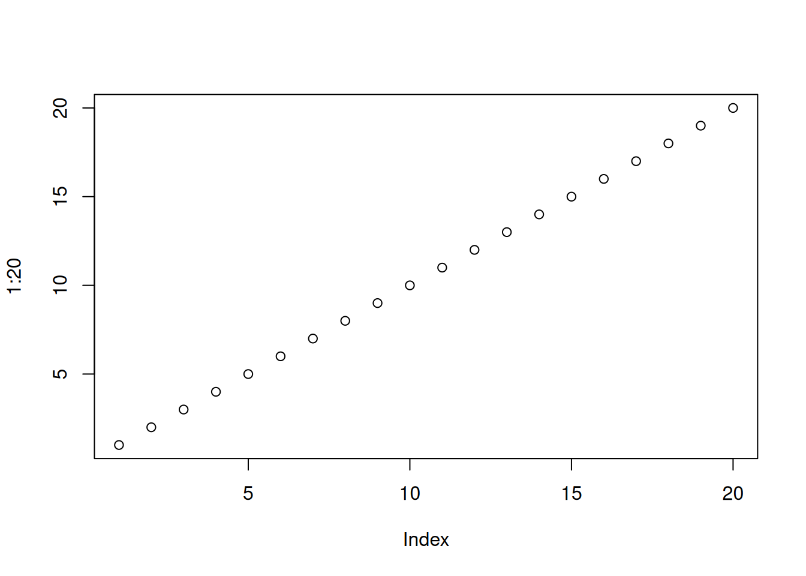

::: {.cell}

```{.r .cell-code}
plot(1:20)
```

::: {.cell-output-display}
{width=672}
:::
:::

::: {.cell}

```{.r .cell-code}
#https://pudding.cool/2024/03/teenagers/
```
:::


This visualization not only provides a good visual in the demographics in high school students throughout time, but it also has personal information you can refer to when you click on one of the students. The visualization neatly organizes students, mainly by adverse events in their childhood to determine the general direction they go in their life, basing it on whether they go to college and their career earnings. This visualization doesn't have data available for some of the students. They often organize the students into groups based on the number of adverse experiences they had in their childhood. I think they could find something else to group the students, such as not having a father or mother, growing up in poverty, etc. They seemed to focus the entire study on just adverse experiences instead of other potential factors that could alter their lives.


::: {.cell}

```{.r .cell-code}
#https://pudding.cool/2024/06/climate-zones/
```
:::


This visualization does a good job at not only classifying types of biomes throughout the world but also gives great detail on parts of the world that fall under each biome. It also gives a wide range of cities in each type of climate for good measure. The way they presented the change in climate type over time was a little different than I expected. They sorted each city into detailed lists with their climates and then moved them around based on what researchers think will happen in the future. It's a cool layout, but I think the research prompt is flawed. There is no mention or proof of any past data to aid in this visualization. It also would have been more intriguing if they had layed out the change in temperature overtime on a map instead of a list.


::: {.cell}

```{.r .cell-code}
#https://pudding.cool/2024/02/anthems/
```
:::


I enjoyed looking at this visualization, as it is really detailed and robust. They have a wide variety of singers who have performed the national anthem at a major event and uploaded the audio recordings to the visualization to give specific examples of what they mean by their "diva" measurement. I also liked how they organized the data by phrases in the song as each one is noticeably different from each performance. The only suggestion for improvement I can think of is having a graphical summary of what determines a higher diva score, whether it is the singer, or major event.
